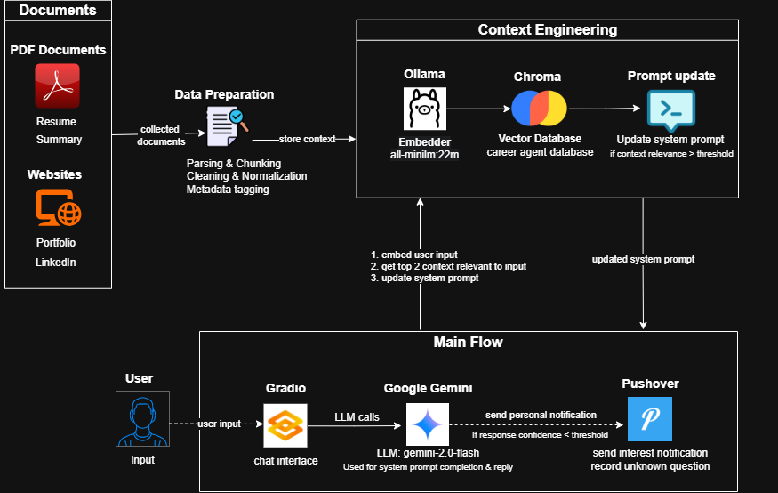

# 💼 Agentic AI: Career Agent Assistant

A personalized AI-powered assistant designed to represent your professional profile, parse your career data, and respond intelligently to inquiries. This project leverages **context engineering**, **vector search**, and **agentic prompting** to create a customized AI chatbot for personal career branding.

---

## 🧠 Project Purpose

**Career Agent** acts as your AI career representative. It reads your professional documents and online presence, transforms them into vectorized memory, and uses LLMs to respond to user questions just as you would — professionally, accurately, and context-aware.

---

## Architecture Diagram



---

## 🧹 Key Features

- Extract and parse content from:
  - 🌐 Personal websites
  - 📄 Resume (PDF)
  - 📃 Summary text
  - 🖼️ Image-based documents (OCR via Tesseract)
- Process and chunk data for efficient context management
- Embed data into a local **Chroma Vector DB**
- Dynamically retrieve top-matching contexts using vector similarity
- Interact via LLMs with prompt updates based on user input
- Log unknown questions and user interest using **Pushover notifications**
- Serve via **Gradio ChatInterface** with UI customization

---

## ⚙️ Technologies & Tools

| Component        | Tool/Library                                  |
| ---------------- | --------------------------------------------- |
| Embedding        | `Ollama` + `all-minilm:22m`                   |
| LLM Agent        | `Google Gemini` / `Ollama`                    |
| Vector DB        | `Chroma`                                      |
| Interface        | `Gradio`                                      |
| Notification     | `Pushover`                                    |
| Document Parsing | `BeautifulSoup`, `pypdf`, `Tesseract`, `PIL`  |
| Prompt Update    | Dynamic system prompts based on input context |

---

## 📊 Pipeline Overview

1. **Data Collection**

   - Read professional info from website, resume (PDF), and summary files.

2. **Preprocessing**

   - Split, clean, and chunk data by sections or fixed lengths.

3. **Embedding & Storage**

   - Embed using `Ollama`
   - Store in `Chroma` vector DB under `"career_agent_db"`

4. **Context Retrieval**

   - When a user asks a question, embed it and fetch top-matching context.

5. **System Prompt Construction**

   - Build a customized prompt with retrieved context.

6. **LLM Agent Chat**

   - Gemini/Ollama generates a response, logs unknown questions, or stores user info using tools.

7. **Frontend**

   - User interacts via a soft-themed `Gradio` ChatInterface.

---

## 📄 Sample Prompts (Chat Examples)

- "What is your current job title?"
- "Do you hold any technical certificates?"
- "What is your recent experience with government clients?"
- "Tell me about your education background?"
- "How can I contact you for a project?"

---

## 🛠️ How to Run

1. Ensure `.env` file includes:

   ```
   GOOGLE_API_KEY=your_google_api_key
   GOOGLE_BASE_URL=your_google_base_url
   PUSHOVER_USER=your_user_key
   PUSHOVER_TOKEN=your_app_token
   ```

2. Run the Jupyter notebook to initialize the vector database and test the query.

3. Launch the interface:

   ```python
   import gradio as gr

   gr.ChatInterface(chat,
       type="messages",
       title="💼 Career Agent",
       description="Mohamed Murad AI Career Avatar.",
       submit_btn="Send",
       theme="soft",
       examples=[
           ["What is your current Job title?"],
           ["How many years of experience do you have?"],
           ["Do you have any technical certificates?"],
           ["What is your experience in MLOps?"],
           ["Talk about your recent client project?"],
           ["How many clients you have worked for?"],
           ["Tell me about your lifestyle?"],
           ["I need to contact with you"]
       ]
   ).launch()
   ```

---

## 🧠 Agent Tools (Function Calls)

| Tool Name                 | Purpose                                 |
| ------------------------- | --------------------------------------- |
| `record_user_details`     | Store user interest + email via push    |
| `record_unknown_question` | Log unknown or out-of-context questions |

---

## 🧬 Example Use Case

**User:** "Tell me about your work at Alinma Bank"\
**Agent:** *(retrieves context about Alinma Bank from parsed documents and responds)*\
If no context is found → it logs the question using `record_unknown_question`.

---

## 🔪 Future Improvements

- Add multi-user session support
- Deploy as a web service with authentication
- Improve OCR pipeline for scanned resumes
- Integrate with LinkedIn API for real-time updates
- Add feedback collection after each session

---

## 🔖 Tags

`#AI` `#AgenticAI` `#Gradio` `#Gemini` `#LLM` `#PersonalBranding` `#CareerAssistant` `#Ollama` `#Chroma` `#DataParsing`

---

## 👨‍💼 Creator

**Mohamed Murad**\
AI Engineer | Data Scientist | Software Developer\
[Portfolio](https://mohamedmurad.github.io/)\
GitHub: [@mohamedmurad](https://github.com/mohamedmurad)

---

